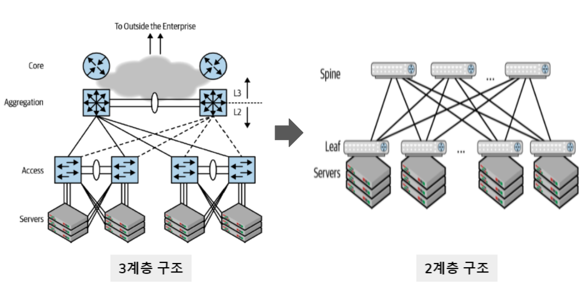

# 1. 홈 네트워크
홈 네트워크 구성은 어떤 회선을 연결하도 동일하다.

> 인터넷 -> 모뎀 -> 공유기 -> 노트북 / 스마트폰 / 태블릿 / 데스크탑

홈 네트워크를 구성하는 데는 모뎀, 공유기, 단말 간에 물리적 연결이 필요하다.
- 유선 연결은 유선 랜 카드, 랜 케이블이 필요
- 무선 연결이라 해도 무선 신호를 보낼 수 있는 매체(공기 등)가 필요.

> 인터넷 -> 케이블 -> 네트워크 장비(모뎀) -> ㄱ공유기 -> 케이블(매체) -> 단말

---
# 2. 데이터 센터 네트워크
안정적이고 빠른 대용량 서비스를 제공하기 위해 데이터 센터 네트워크를 구성한다.
  - 안정성을 위해 이중화 기술을 사용
  - 높은 통신량을 수용

기존에는 3계층 구성ㅇ이 일반적이었으나, 현재는 2계층 구성이 일반적이다.

[이미지 출처](https://velog.io/@dev_grow_up/IT-%EC%97%94%EC%A7%80%EB%8B%88%EC%96%B4%EB%A5%BC-%EC%9C%84%ED%95%9C-%EB%84%A4%ED%8A%B8%EC%9B%8C%ED%81%AC-%EC%9E%85%EB%AC%B8-%EC%A0%9C-1%EC%9E%A5.-%EB%84%A4%ED%8A%B8%EC%9B%8C%ED%81%AC-%EC%8B%9C%EC%9E%91%ED%95%98%EA%B8%B0)

2계층 구성은 최근의 트랙픽 경향을 지원하기 위해 제안됐다.
