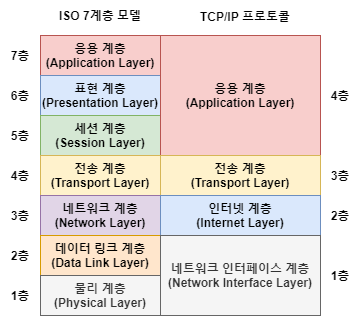

# 1. OSI 7 계층

[이미지 출처](https://huimang2.github.io/etc/iso-standard-7498)

| 계층            | 데이터  | 레이어           |
|---------------|------|---------------|
| 응용(애플리케이션) 계층 | Data | 상위 (upper)    |
| 표현(프레젠테이션) 계층 | Data | 상위(upper)     |
| 세션 계층         | Data | 상위 (upper)    |
| 전송(트랜스포트) 계층  | Segment | 하위(data flow) |
| 네트워크 계층       | Packet | 하위(data flow) |
| 데이터 링크 계층     | Frame | 하위(data flow) |
| 물리 계층         | Bit  | 하위(data flow) |

- 애플리케이션 개발자들은 애플리케이션 계층 프로토콜을 개발할 때 하위 계층을 고려하지 않고 데이터를 표현하는데 초점을 맞춘다
- 반대로, 네트워크 엔지니어는 애플리케이션 계층에 심각하게 고민하지 않는다.

---
# 2. TCP/IP 프로토콜 스택

[이미지 출처](https://huimang2.github.io/etc/iso-standard-7498)
대부분의 네트워크는 TCP/IP 와 이더넷으로 이뤄져 있다.

TCP/IP 는 이론보다 실용성에 중점을 둔 프로토콜이다.
