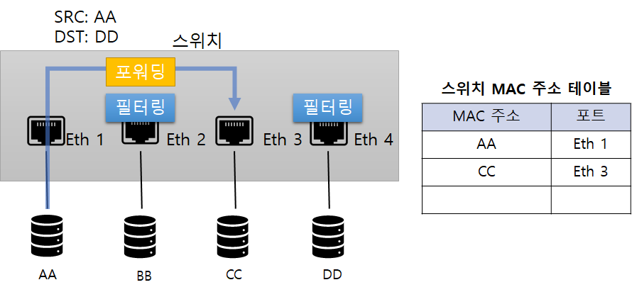
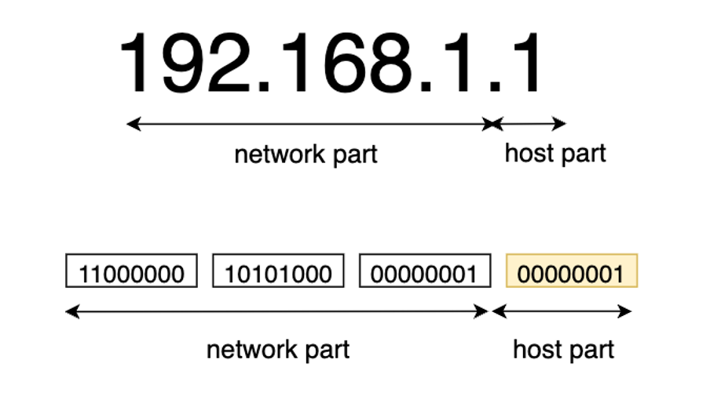
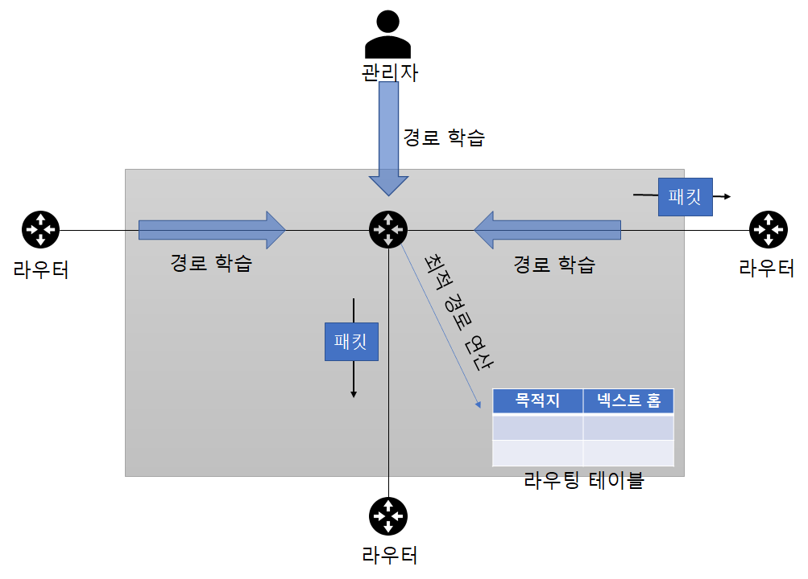

# 1. 1계층 (피지컬 계층)
1계층은 물리 계층으로 물리적 연결과 관련된 정보를 정의한다.
- 주로 전기 신호를 전달하는데 초점이 맞춰진다.
- 다음의 장비들을 활용한다. 
  1. 허브와 리피터: 네트워크 통신을 중재
  2. 케이블과 커넥터: 케이블 본체를 구성하는 요소
  3. 트랜시버: 컴퓨터의 랜카드와 케이블 연결
  4. 탭: 전기 신호를 다른 장비로 복제
  
---
# 2. 2계층(데이터 링크 계층)
2계층은 전기 신호을 데이터로 변환하는 역할을 한다.
- 피지컬 계층에서 전달된 데이터를 프레임으로 변환한다.
- 피지컬은 전기 신호를 잘 보는데 초점이 맞춰져 있다면 데이터 링크는 출발지와 도착지 주소를 확인하고 내게 온 것이 맞는 지 검사하고 데이터 처리를 한다.

데이터에 대한 에러를 탐지하거나 고치는 역할을 수행할 수 있다.
- 하지만, 현재 이더넷 기반의 네트워크에서는 에러를 탐지하는 기능만 사용한다.

### 플로 컨트롤
- 데이터를 받는 사람이 현재 데이터를 받을 수 있는지 확인하는 작업
1. 서버에서 스위치로 데이터 전송
2. 스위치 혼잡 상황 발생시 Pause 프레임 전송
3. 서버는 Pause 프레임 수신 후 대기

2계층의 가장 중요한 특징은 MAC 주소라는 주소 체계가 있다는 것
- NIC(Network Interface Card)와 스위치는 모두 MAC 주소를 이해하고 MAC 주소를 보고 통신해야할 포트를 지정해 내보낼 수 있다.

### NIC
아래와 같이 불리는 용어가 많으나 결국 하나를 가리킨다.
1. 네트워크 인터페이스 카드(혹은 컨트롤러)
2. 네트워크 카드
3. 랜 카드
4. 물리 네트워크 인터페이스
5. 이더넷 카드
6. 네트워크 어댑터

### 스위치
스위치는 단말이 어떤 MAC 주소인지, 연결된 포트는 어느 것인지 주소 습득 과정에서 알 수 있다.

[이미지 출처](https://catsbi.oopy.io/315731e3-1730-4690-ad8f-663e0af7621b)
- 이 데이터를 기반으로 적절히 필터링, 포워딩 해준다
- 그 결과 통신이 필요한 포트만 사용하고 네트워크 전체에 불필요한 처리가 감소되어 네트워크 효율성이 높아졌다.

---
# 3. 3계층(네트워크 계층)
IP 주소와 같은 논리적 주소가 정의된다
- IP 주소는 MAC 주소와 달리 사용자 환경에 맞게 변경해서 사용할 수 있고 네트워크 주소와 호스트 주소로 나뉜다.
- 3계층의 장비 라우터는 네트워크 주소 정보로 자신이 속한 네트워크와 원격지 네트워크를 구분하고 경로를 지정할 수 있다.

[이미지 출처](https://ittrue.tistory.com/183)

라우터는 3계층에서 정의한 IP 주소를 이해할 수 있다.
- IP 주소로 최적의 경로를 찾고, 해당 경로로 패킷을 전송한다.

[이미지 출처](https://catsbi.oopy.io/225439bd-ec84-4e16-aeca-0dfcb9954ea6)

---
# 4. 4계층(트랜스포트 계층)
하위 계층인 1~3 계층은 신호와 데이터를 올바른 위치로 보내고 실제 신호를 잘 만들어 보내는 데 집중한다.

반면 4계층은 실제 해당 데이터를 <b>정상적</b>으로 보내는 역할을 한다
- 패킷 네트워크는 데이터를 분할해서 패킷에 실어 보낸다.
- 중간에 패킷이 유실되거나 순서가 바뀌어 도착하는 경우가 있을 수 있음
- 이런 문제를 4계층에서 해결하는 것
  - 4 계층에서 패킷을 분할할 때 헤더에 보내는 시퀀스 번호(Sequence Number)와 받는 순서 ACK 번호(Acknowledgement Number)를 명시

4계층에서 동작하는 장비는 로드 밸런서, 방화벽 등이 있다.

---
# 5. 5계층(세션 계층)
양 끝단의 응용 프로세스가 연결되도록 도와주고 연결을 안정적으로 유지/관리 한 후, 작업 완료하면 끊는 역항르 한다.
- TCP/IP 세션을 만들고 없애는 책임이 있는 것.
- 에러로 중단된 통신에 대한 복구와 재전송도 수행한다

---
# 6. 6계층(프레젠테이션 계층)
시스템 간의 통신을 돕기 위해 하나의 통일된 구문 형식으로 변환하는 기능을 수행한다.
- 번역기, 변환기 같은 역할을 수행
- MIME 인코딩, 암호화, 압축, 코드 변환같은 동작이 이 계층에서 이뤄진다.

---
# 7. 7계층(애플리케이션 계층)
최상위 계층으로 애플리케이션 프로세스를 정의하고 서비스를 수행한다.
- 네트워크 소프트웨어의 UI, 사용자의 입-출력 부분을 정의한다.
- FTP, HTTP, SMTP, TELNET 등의 프로토콜이 있다.

---
## * 계층별 주요 프로토콜 및 장비
| 계층        | 주요 프로토콜                                     | 장비             
|-----------|---------------------------------------------|----------------|
| 애플리케이션 계층 | HTTP, SMP, SMTP, STUN, TFTP, TELNET         | ADC, NGFW, WAF |
| 프레젠테이션 계층 | AFP, SSH, TLS                               | -              |
| 세션 계층     | L2TP, PPTP, NFS, RPC, RTCP, SIP, SSH        | -              |
| 트랜스포트 계층  | TCP, UDP, SCTP, DCCP, AH, AEP               | 로드 밸런서, 방화벽    |
| 네트워크 계층   | ARP, IPv4, IPv6, NAT, IPSec, VPRP, 라우팅 프로토콜 | 라우터, L3 스위치    |
| 데이터 링크 계층 | IEEE 802.2, FDDI | 스위치, 브릿지, NIC |
|피지컬 계층 | RS-232, RS-449, V.35 등의 케이블 | 케이블, 허브, 탭|

