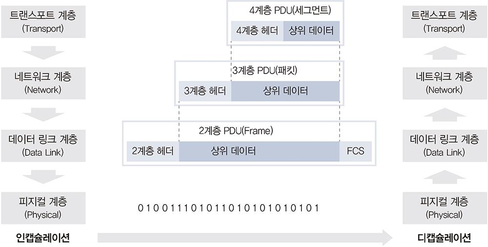

데이터를 보내는 과정을 인캡슐레이션(Encapsulation)이라고 하며, 데이터를 받는 과정을 디캡슐레이션(Decapsulation)이라고 한다.

[이미지 출처](https://velog.io/@source39/%EB%84%A4%ED%8A%B8%EC%9B%8C%ED%81%AC-%EC%9D%B8%EC%BA%A1%EC%8A%90%EB%A0%88%EC%9D%B4%EC%85%98%EA%B3%BC-%EB%94%94%EC%BA%A1%EC%8A%90%EB%A0%88%EC%9D%B4%EC%85%98)

현대 네트워크는 대부분 패킷 기반이다.
- 데이터를 작은 단위인 패킷으로 쪼개 보내는 것
- 데이터를 패킷으로 쪼개서 네트워크를 통해 목적지까지 보내고, 받는 쪽에서 패킷을 다시 큰 데이터 형태로 결합해 사용해야 한다.

### 인캡슐레이션
애플리케이션에서 데이터를 데이터 플로 계층(1~4계층) 으로 내릴 때 패킷에 데이터를 넣어 분할하는 과정
- 네트워크 상황을 고려ㅑ해 적절한 크기로 쪼갠다.
- 4계층부터 네트워크 전송을 위한 정보를 헤더에 붙인다.

데이터 플로 계층에서만 3개의 헤더 정보가 추가된다.

### 디캡슐레이션
받은 전기 신호를 만들어 데이터 형태로 만들고 2계층으로 보낸다.
- 2계층 송신자가 작성한 2계층 헤더 정보를 확인하고 정확한 목적지까지 보낸다 (랜 카드가 이 역할을 담당)
- 만약 본인이 받아야 할 데이터가 아니라면 데이터를 버리고 목적지가 본인이 맞다면 데이터를 받아들여 3계층으로 정보를 보낸다.

3계층은 2계층이 동작했던 것처럼 본인에게 온 것인지 확인 후 아니라면 버리고 맞다면 4계층으로 보낸다.

4계층도 3계층과 같은 과정을 거쳐 애플리케이션으로 올려 보낸다.

### 정리
> 상위 계층 --- (인캡슐레이션) ---> 하위 계층
>
> 하위 계층 --- (디캡슐레이션) ---> 상위 계층

---
인캡슐레이션에서 헤더에 추가하는 정보에는 반드시 두 가지를 포함해야 한다.

1. 현재 계층에서 정의하는 정보
2. 상위 프로토콜 지시자

4계층의 목적은 큰 데이터를 잘 분할하고 받는 쪽에서 잘 조립하는 것이기에 위의 정보를 반드시 넣어야 한다.

TCP/IP 의 4계층 프로토콜인 TCP 에서는 시퀀스(SEQUENCE), 애크(ACKnowledgement) 번호 필드로 데이터를 표현한다.

헤더에 넣는 정보
- 3계층 : 3계층에서 정의하는 논리적 주소인 출발지, 도착지 IP 주소
- 2계층 : MAC 주소를 정의

[이미지 출처](https://zigispace.net/1258?pidx=0)

--- 
각 계층마다 상위 프로토콜 지시자를 갖고 있지만 이름이 다르다
- 4계층: 포트 번호
- 3계층 : 프로토콜 번호
- 2계층 : 이더 타입

