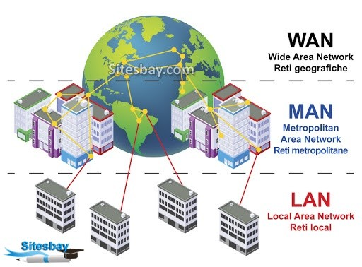

# 1. 네트워크 연결 구분

[이미지 출처](https://www.linkedin.com/pulse/network-types-lan-wan-pan-can-man-san-wlan-taiwo-amao-b-tech/)

### MAN
수~수십 km 범위의 한 도시를 네트워크로 연결하는 개념
- 통신사가 이미 갖고 있는 인프라 기반의 네트워크 : WAN
- 자체 인프라를 통해 구축하면 MAN

### LAN
Local Area Network
- 홈 네트워크용, 사무실 네트워크 등 소규모의 네트워크
- 대부분 이더넷 기반 전송 기술을 사용

자신이 소유한 건물이나 대지에 직접 구축한 선로로 동작시키는 네트워크

### WAN
Wild Area Network
- 먼 거리에 있는 네트워크를 연결하기 위해 사용
- 멀리 떨어진 LAN 을 서로 연결하거나 인터넷 접속을 위한 네트워크 등
- 대부분 통신사업자(SK, KT, LG 등)가 제공하는 서비스를 이용

