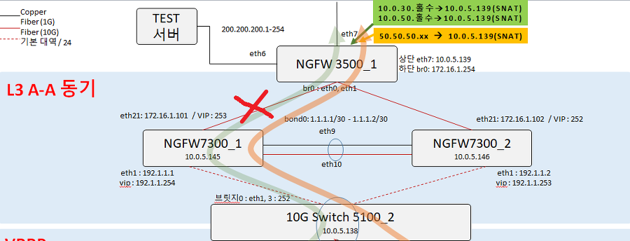
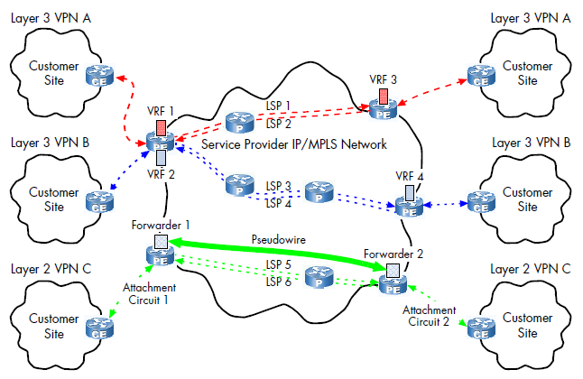

# 1. 인터넷 회선
인터넷 접속을 위해 통신사업자와 연결하는 회선
- 전송 선로 공유 기술을 사용하여 일반 가정에서 인터넷을 사용한다.

---
# 2. 전용 회선
가입자와 통신사업자 간에 대역폭을 보장해주는 서비스
- 전용 케이블로 연결돼 있고 TDM 같은 기술로 마치 직접 연결한 것같은 통신 품질을 보장
 
### 저속 : 음성 전송 기술 기반
보통 높은 속도가 필요하지 않거나 높은 신뢰성이 필요할 때 사용
- 현재 이더넷 기반의 광 전송 기술이 신뢰할 정도의 수준으로 발전해 사용 빈도가 줄어듦

VAN(Value Added Network) 와 같이 높은 신뢰성이 필요한 경우 저속 회선을 사용하는 경우 많음

### 고속: 메트로 이더넷
광케이블 기반의 이더넷을 사용
- 기업자와 통신사업자 간의 접속 기술은 이더넷을 사용
- 통신사업자 내부에서는 개별 가입자를 묶어 통신할 수 있는 다른 고속 통신 기술을 사용

### LLCF(Link Loss Carry Forward)
한쪽 링크가 다운되면 반대쪽 링크도 다운시키는 기능
- 회선 개통 후, 회선사에서 LLCF 설정이 돼 있는지 확인해야 한다.

[이미지 출처](https://kyumoonhan.tistory.com/70)

---
# 3. 인터넷 전용 회선
인터넷 연결 회선에 대한 통신 대역폭을 보장해주는 상품
- 가입자가 통신사업자와 연결되고 이 연결이 인터넷과 연결되는 구조
- 인터넷 전용 회선은 가입자가 일반 가정에서 사용하는 접속 기술과 달리, 다른 가입자와 경쟁하지 ㅇ낳고 통신사업자와 가입자 간 연결 품질을 보장.

최근 광 접속 기술을 사용함에 따라 인터넷 전용 회선과 일반 가정 가입자들의 네트워크 기술 차이가 줄어듦.

---
# 4. VPN
Virtual Private Network
- 전용선이 아니지만 가상으로 직접 연결한 것 같은 효과가 나도록 하는 네트워크 기술

### 통신사업자 VPN
전용선은 연결 거리가 늘어날수록 비용이 증가
- 사용 가능한 대역폭을 보장해주지만 가입자가 계약된 대역폭을 항상 100% 사용하지 않아 낭비되는 비용이 클 수 있음
- 먼 거리와 연결하더라도 비용을 줄이기 위해 통신사업자가 직접 가입자를 구분할 때 VPN 기술을 사용

가장 대표적인 기술이 MPLS VPN

    
[이미지 출처](https://velog.io/@lijahong/0%EB%B6%80%ED%84%B0-%EC%8B%9C%EC%9E%91%ED%95%98%EB%8A%94-%EB%84%A4%ED%8A%B8%EC%9B%8C%ED%81%AC-%EA%B3%B5%EB%B6%80-Region-VPN-MPLS-VPN-0rvs4ogv)

Multi Protocol Label Switching (MPLS) 기술을 사용해 가입자 간의 통신을 구분
- 여러 가입자가 하나의 MPLS 망에 접속하지만 가입자를 구분할 수 있는 기술을 적용해 전용선처럼 사용
- 여러 가입자가 하나의 망에 접속해 통신하므로 비용이 낮아짐
- MPLS VPN 회선은 거리보다 속도의 영향을 받으므로 거리가 멀수록 비용 절감에 도움됨

### 가입자 VPN
일반 사용자가 VPN 을 사용하는 것
- 일반 인터넷망으로 사용자가 직접 가상 전용 네트워크를 구성
- 비용을 절감하기 위해 인터넷 연결을 이용한 VPN 을 사용

---
# 5. DWDM
Dense Wavelength Division Multiplex(파장 분할 다중화) 전송 기술
- 먼거리릍 통신할 때 비용과 관리 문제를 극복하기 위해 개발
- 하나의 광케이블에 다른 파장의 빛으로 여러 채널을 만드는 동시에 많은 데이터를 제공