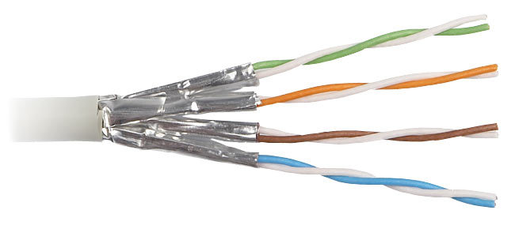
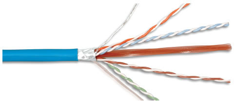
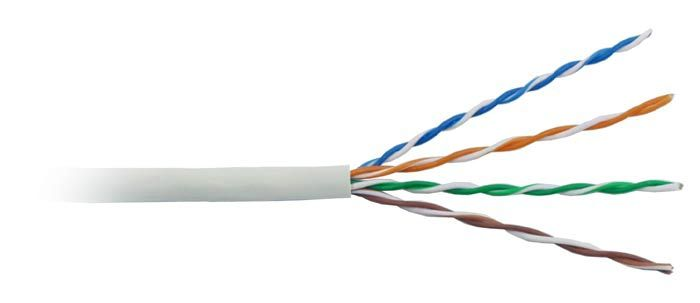
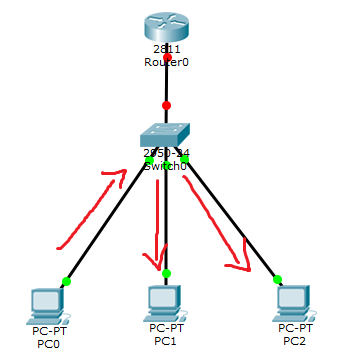
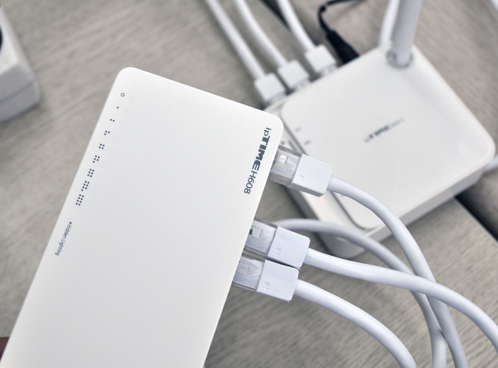
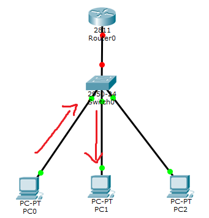
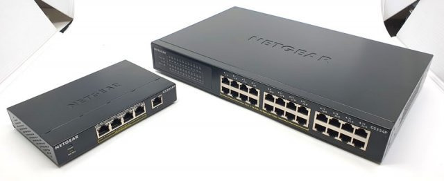
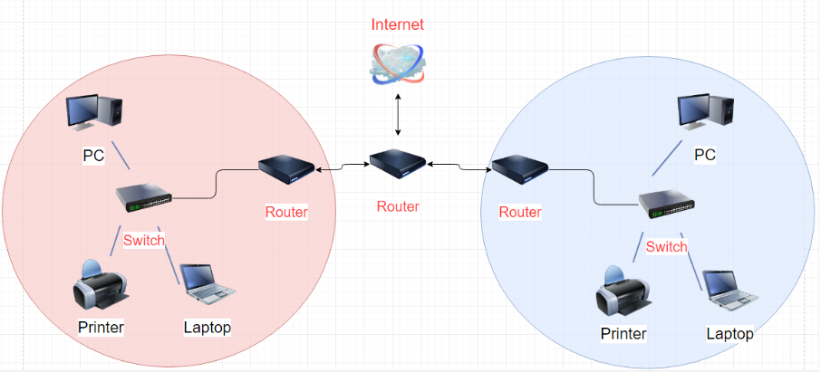

# 1. 네트워크 인터페이스 카드(NIC)
랜 카드, 네트워크 카드, 네트워크 인터페이스 컨트롤러 등의 이름으로 불림

<b>컴퓨터를 네트워크에 연결하기 위한 하드웨어 장치</b>

### 주요 역할
1. 직렬화
   - 전기 신호를 데이터 신호 형태로, 데이터 신호를 전기 신호 형태로 변환
2. MAC 주소
   - 받은 패킷의 도착지 주소가 NIC 가 갖는 MAC 주소와 일치하는지 확인
3. 흐름 제어
   - 데이터 유실 방지를 위해 데이터를 받지 못할 때는 상대방에게 통신 중지를 요청할 수 있음

---
# 2. 케이블과 커넥터
케이블에는 트위스티드 페어 케이블, 광 케이블, 동축 케이블 등이 있음

### 이더넷 네트워크 표준
현재 가장 많이 사용되는 네트워크 기술은 이더넷 방식
- 기가바이트 이더넷 : 일반 PC 와 같은 종단
- 10기가바이트 이더넷 : 데이터 센터의 서버와 같은 종단
- 상위 스위치는 대역폭 확보를 위해 40기가바이트나 10기가바이트 이더넷을 사용

대중적으로 사용하는 표준은 총 세 가지
1. 1,000BASE-T/10GBASE-T
    - 트위스티드 페어 케이블을 이용
2. 1,000BASE-SX/10GBASE-SR
    - 멀티모드 광케이블을 사용. 비교적 짧은 거리를 보내는 이더넷 표준
3. 1,000BASE-LX/10GBASE-LR
   - 싱글모드 광케이블을 사용. 비교적 먼 거리를 보내는 이더넷 표준

> 1,000 : 속도
> 
> BASE : 채널
> 
> T : 케이블 타입 (T는 트위스티드페어)

### 트위스티드 페어 케이블
가장 많이 사용하는 케이블
- 쉴드를 장착한 STP/FTP 케이블과 쉴드가 없는 UTP 케이블로 분류
- 1G 속도를 지원하는 대중적인 케이블로 데스크탑, 노트북과 같은 일반 단말 연결에 적합

 
<b>STP</b>

<b>FTP</b>

<b>UTP</b>

[이미지 출처](https://m.blog.naver.com/tyghvm100/220249776870)

### 동축 케이블
TV와 연결할 떄 사용되는 두꺼운 검정 케이블같은 종류

### 광케이블
다른 구리선(UTP, 동축)보다 신뢰도가 높고 더 먼 거리까지 통신이 가능
- 광케이블은 감쇄와 간섭으로부터 비교적 자유로움

1. 싱글 모드
   - 먼 거리 통신을 지원.
   - 케이블 굵기가 가늘고 광원으로 레이저를 사용

2. 멀티 모드
   - 비교적 굵은 케이블, 광원으로 led 사용

---
# 3. 허브
케이블과 동일한 1계층에서 동작하는 장비
- 전기 신호를 재생성해주고, 여러 장비를 연결할 목적으로 사용
- 현재 허브는 거의 사용되지 않음 (무한 순환, 모든 단말의 경쟁 등)

[이미지 출처](https://jdcyber.tistory.com/52)
---
# 4. 스위치
허브와 동일하게 여러 장비를 연결하고 통신을 중재하는 2계층 장비
- 여러 장비를 연결하고 케이블을 한 곳으로 모아주는 역할

MAC 주소를 이해
- MAC 주소 위치를 파악하고 목적지가 연결된 포트로만 전기 신호를 보냄

[이미지 출처](https://jdcyber.tistory.com/52)

----
# 5. 라우터
3계층 장비. 먼 거리로 통신할 수 있는 프로토콜로 변환
- 원격지로 쓸데없는 패킷이 전송되지 않도록 브로드캐스트와 멀티캐스트를 컨트롤
- 불분명한 주소로 통신할 경우 버림
- 

[이미지 출처](https://coding-chobo.tistory.com/38)

---
# 6. 로드 밸런서
일반적으로 4계층에서 동작. 7계층에 로드밸런서는 별도로 ADC 라 부름

4계층 포트 주소를 확인하는 동시에 IP 주소를 변경할 수 있음
- 웹에서 보통 많이 사용함
- 웹 서버를 증설하고 싶을 떄 로드밸런서를 웹 서버 앞에 두고 웹 서버를 여러 대로 늘림

--- 
# 7. 보안 장비(방화벽/IPS)
정보를 잘 제어하고 공격을 방어하는데 초점

방화벽은 4계층에서 동작해 방화벽을 통과하는 패킷의 3, 4계층 정보를 확인하고 패킷을 정책과 비교해 버리거나 포워딩함.

--- 
# 8. 기타(모뎀/공유기 등)
공유기는 내부 스위치 부분, 무선 부분, 라우터 부분 회로 등으로 나뉨
- LAN 포트, WAN 포트 모두 일반 이더넷. 먼거리 통신은 불가능.

