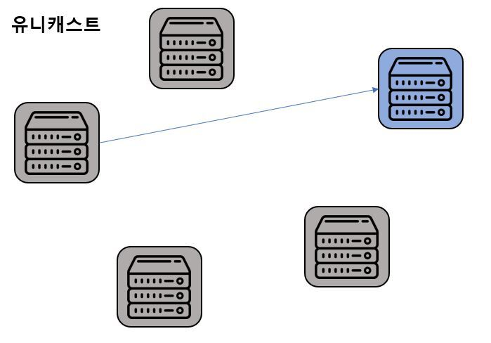
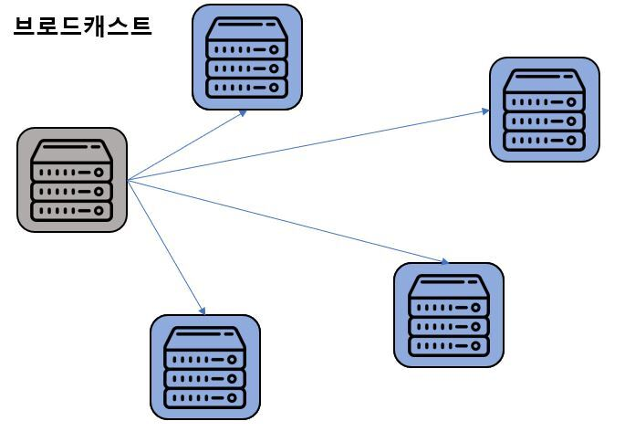
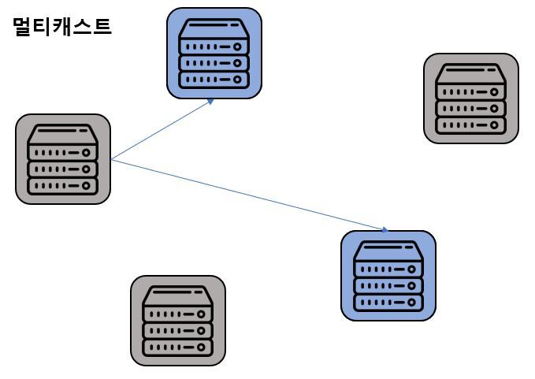

# 1. 유니 캐스트
1:1 통신
- 출발지와 목적지가 1:1
- 실제로 사용하는 대부분의 통신이 유니캐스트 방식

[이미지 출처](https://velog.io/@moon-july5/%EC%9C%A0%EB%8B%88%EC%BA%90%EC%8A%A4%ED%8A%B8-%EB%A9%80%ED%8B%B0%EC%BA%90%EC%8A%A4%ED%8A%B8-%EB%B8%8C%EB%A1%9C%EB%93%9C%EC%BA%90%EC%8A%A4%ED%8A%B8-%EC%95%A0%EB%8B%88%EC%BA%90%EC%8A%A4%ED%8A%B8)

---
# 2. 브로드 캐스트
1:모든 통신
- 동일 네트워크에 존재하는 모든 호스트가 목적
- 목적지 주소가 모든 호스트
- 유니캐스트로 통신하기 전 상대의 정확한 위치를 알기 위해 사용
- 로컬 네트워크 내에서 호스트에 패킷을 전달할 때 사용

[이미지 출처](https://velog.io/@moon-july5/%EC%9C%A0%EB%8B%88%EC%BA%90%EC%8A%A4%ED%8A%B8-%EB%A9%80%ED%8B%B0%EC%BA%90%EC%8A%A4%ED%8A%B8-%EB%B8%8C%EB%A1%9C%EB%93%9C%EC%BA%90%EC%8A%A4%ED%8A%B8-%EC%95%A0%EB%8B%88%EC%BA%90%EC%8A%A4%ED%8A%B8)

---
# 3. 멀티 캐스트
그룹 주소를 이용해 해당 그룹에 속한 다수의 호스트로 패킷을 전송
- IPTV 와 같은 실시간 방송
- 다수에게 동시에 같은 내용을 전달해야할 때 사용

[이미지 출처](https://velog.io/@moon-july5/%EC%9C%A0%EB%8B%88%EC%BA%90%EC%8A%A4%ED%8A%B8-%EB%A9%80%ED%8B%B0%EC%BA%90%EC%8A%A4%ED%8A%B8-%EB%B8%8C%EB%A1%9C%EB%93%9C%EC%BA%90%EC%8A%A4%ED%8A%B8-%EC%95%A0%EB%8B%88%EC%BA%90%EC%8A%A4%ED%8A%B8)

---
# 4. 애니 캐스트
1:1 통신(목적지는 동일 그룹 내의 1개 호스트)
- 다수의 동일 그룹 중 가장 가까운 호스트에서 응답
- IPv4 에서는 일부 기능 구현, IPv6 는 모두 구현 가능
  - IPv6 에서는 브로드 캐스트가 존재하지 않고 링크 로컬 멀티 캐스트로 대체