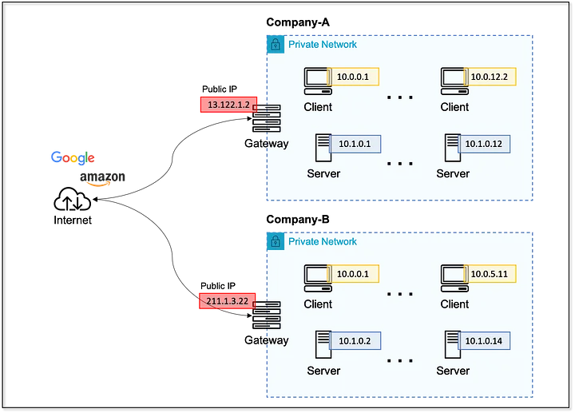

OSI 7계층에서 주소를 갖는 계층은 2계층과 3계층이다.
- 2계층: MAC 주소
- 3계층: IP 주소

대부분 TCP/IP 로 동작하기에 IP 주소 사용이 매우 중요하다.

---

# 1. IP 주소 체계
우리가 흔히 사용하는 IP 주소는 32비트인 IPv4 주소다.
-  IPv6 주소는 128비트로 더 많은 주소를 사용할 수 있다.

[이미지 출처](https://velog.io/@satoshi25/IP-%EC%A3%BC%EC%86%8C)

IP 주소는 네트워크 주소와 호스트 주소 두 개로 나뉜다.
1. 네트워크 주소 
   - 호스트들을 모은 네트워크를 지칭하는 주소
   - 네트워크 주소가 동일한 네트워크를 로컬 네트워크라고 함
2. 호스트 주소
   - 하나의 네트워크 내에 존재하는 호스트를 구분하기 위한 주소

IP 주소 체계는 필요한 호스트 IP 개수에 따라 네트워크 크기를 다르게 할당할 수 있다.
- 이를 클래스 개념이라 한다.
- 네트워크 주소와 호스트 주소의 구분은 클래스에 따라 다르다.

    
[이미지 출처](https://velog.io/@satoshi25/IP-%EC%A3%BC%EC%86%8C)

|    클래스     | A 클래스 | B 클래스 | C 클래스 | D 클래스 | E 클래스 |
|:----------:|:-----:|:-----:|:-----:|:-----:|:-----:|
| 네트워크 주소 옥텟 |  1개   |  2개   |  3개   | 멀티 캐스트 | 예약 |
| 호스트 주소 옥텟  |  3개   |  2개   |  1개   | 멀티 캐스트 | 예약 |
| 맨 앞 옥텟 주소 | 0~127 | 128~191 | 192~223 | 224~239 | 240~255 |

맨 앞 옥텟 주소가 127은 루프백(자기 자신) 주소로 사용된다.

--- 
# 2. 클래스풀과 클래스리스
클래스 기반의 IP 주소 체계를 클래스풀이라고 한다.
- 첫 도입시 확장성 있고 주소 낭비가 적은 최적의 조건을 만들 수 있는 좋은 선택이었다.
- 네트워크 주소와 호스트 주소를 구분짓는 구분자(서브넷 마스크)가 필요 없었다

### 클래스리스 네트워크 등장
문제는 호스트 숫자가 폭발적으로 증가해 클래스풀로 감당하기에는 수가 부족했다.
- IP 주소 부족과 낭비를 해결하기 위해 3가지 보존, 전환 전략을 만든다.

1. 단기 대책 : 클래스리스, CIDR 기반의 주소 체계
2. 중기 대책 : NAT 와 사설 IP 주소
3. 장기 대책 : IPv6 (차세대 IP)

IPv5 의 가장 큰 문제는 상위 클래스(A 클래스)를 할당 받은 조직이 주소를 제대로 사용 못하는데서비롯된다.
- 이를 해결하기 위해 클래스 개념 자체를 없애는 클래스리스 기반 주소 체계가 확립된다.

클래스리스 네트워크에서는 네트워크와 호스트 주소를 나누는 구분자가 필요하다
- 이를 서브넷 마스크라 부른다. 
 

[이미지 출처](https://velog.io/@satoshi25/IP-%EC%A3%BC%EC%86%8C)

서브넷 마스크는 IP 주소와 네트워크 주소를 구분할 때 사용한다.
- 2진수 숫자 1은 네트워크 주소, 0은 호스트 주소로 표시한다.
- 10진수를 사용해서 255.0.0.0, 255.255.0.0, 255.255.255.0 과 같이 표기한다.
- 255는 네트워크 주소 부분, 0은 호스트 주소 부분으로 표현한다.

---
# 3. 서브네팅
사용자가 네트워크, 호스트 구분 기준을 정해 네트워크를 더 쪼개서 사용하는 방식을 서브네팅이랗 ㅏㄴ다.
- 옥텟 단위보다 더 잘게 네트워크를 쪼개 2진수 1비트 단위로 네트워크를 분할한다.

서브네팅을 고민해야 하는 경우는 크게 두 가지다.
1. 네트워크를 효율적으로 어덯게 분할할 것인지 계획하는 경우
2. 이미 분할된 네트워크에서 사용자가 자신과 원격지 네트워크를 구분해야 하는 경우

---
# 4. 공인 IP 와 사설 IP
공인 IP
- 인터넷에 접속하기 위해 필요한, 전 세계에서 유일해야 하는 식별자

사설 IP
- 공인 IP 주소를 할당받지 않고 네트워크를 구축하는 경우

인터넷에 접속하려면 통신사업자로부터 IP 주소를 할당 받거나 IP 할당 기관에서 할당받아야 한다.
- 인터넷에 접속하지 않거나 NAT 기술을 사용하는 경우(e.g. 공유기나 회사 방화벽을 사용하는 경우) 사설 IP 주소를 사용할 수 있다.
- 이 주소들은 RFC 에 명시돼 있다.
- 인터넷에 직접 접속하지 못하지만 IP 를 변환해주는 NAT 장비에서 공인 IP 로 변경하면 인터넷 접속이 가능해진다.
  - 공유기가 대표적인 NAT 장비다

[이미지 출처](https://medium.com/bokunn91/192-168-172-16-31-10-%EC%82%AC%EC%84%A4-%EB%84%A4%ED%8A%B8%EC%9B%8C%ED%81%AC-ip-%EC%9D%98-%EB%AA%A8%EB%93%A0-%EA%B2%83-6409701e8e00)

### 클래스별 사설 IP 주소
|   네트워크 주소   | IP 범위 |  클래스 크기   |
|:-----------:|:-----:|:---------:|
| 10.0.0.0/8 | 10.0.0.0 ~ 10.255.255.255 | A 클래스 1개  |
| 172.16.0.0/12 | 172.16.0.0 ~ 172.31.255.255 | B 클래스 16개 |
| 192.168.0.0/16 | 192.168.0.0 ~ 192.168.255.255 | C 클래스 256개 |

[이미지 출처](https://medium.com/bokunn91/192-168-172-16-31-10-%EC%82%AC%EC%84%A4-%EB%84%A4%ED%8A%B8%EC%9B%8C%ED%81%AC-ip-%EC%9D%98-%EB%AA%A8%EB%93%A0-%EA%B2%83-6409701e8e00)

사설 IP 는 A 클래스 1개, B 클래스 16개, C 클래스 256개로 사용할 수 있다.
- 규모가 큰 경우, 10.0.0.0/8 을
- 규모가 작은 경우 C 클래스 192.168.x.0/24 를 사용한다.

### Bogon IP
사용하지 말아야 할 IP 주소를 Bogon IP 라고 한다.
- 최상위 기구인 : LANA 에서 지정
- 만약 이 주소로 사용한 통신 시도가 있다면 해킹을 목적으로 IP 를 스푸핑(주소 변조)했거나 실수로 할당된 IP 다

|  IP 주소  |            설명             |
|:------:|:-------------------------:|
|0.0.0.0/8 |         This 네트워크         |
|10.0.0.0/8 |          사설 네트워크          |
|127.0.0.0/8 |            루프백            |
|127.0.53.53 |         네임 콜리전 발생         |
|172.16.0.0/12|          사설 네트워크          |
|192.0.0.0/24 | IETF Protocol Assignments |
|192.168.0.0/16 |          사설 네트워크          |
|192.18.0.0/15 |         벤치마크 테스팅          |
|255.255.255.255/32 |        브로드캐스트         |
