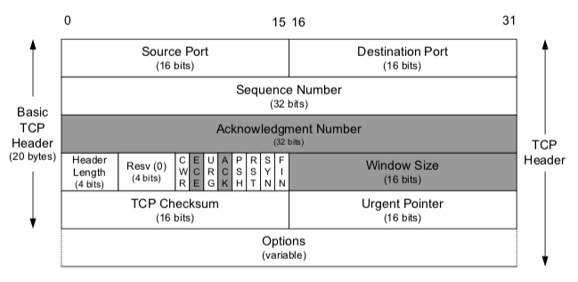

# 1. 4계층 프로토콜(TCP, UDP)와 서비스 포트
인캡슐레이션, 디캡슐레이션 과정에서 각 계층에서 정의하는 헤더가 추가되고 여러 정보가 들어간다.
1. 각 계층에서 정의하는 정보
   - 수신 측의 동일 계층에서 사용하기 위한 정보 
2. 상위 프로토콜 지시자 정보
    - 디캡슐레이션 중 상위 계층의 프로토콜이나 프로세스를 정확히 찾아가기 위한 목적으로 사용된다.
    - 2계층은 이더 타입, 3계층은 프로토콜 번호, 4계층은 포트 번호가 상위 프로토콜 지시자다.

TCP/IP 프로토콜 스택에서 4계층은 TCP 와 UDP 가 담당한다.

패킷을 분할하고 조립하기 위해 TCP 프로토콜에서는 시퀀스 번호와 ACK 번호를 사용한다.

### TCP HEADER

[이미지 출처](https://hiflo.tistory.com/24)

### UDP HEADER

[이미지 출처](https://hiflo.tistory.com/24)

TCP/IP 프로토콜 스택에서 상위 프로토콜 지시자는 포트 번호다.
- TCP/IP 에서 클라이언트 - 서버 방식으로 서비스를 제공한다.
- 포트 번호는 출발지와 목적지를 구분해서 처리해야 한다. 

우리가 표현하는 포트 번호의 기준은 서버의 포트다
- HTTP, TCP 80, HTTPS, TCP443, SMTP TCP 25 와 같이 잘 알려진 포트를 웰노운 포트라고 한다.
- 이미 LANA 에 등록되고 1023번 이하의 포트 번호를 사용한다.

다양한 애플리케이션에 포트를 할당하고자 registered port 범위를 사용한다.
- 1024 ~ 49151 의 범위를 사용한다 (49152~65535 는 dynamic, private port)
- 포트 번호를 할당받고자 신청하면 LANA 에 등록되어 관리되지만 공식/비공식 번호가 혼재돼 있고 사설 포트 번호로 사용된다.

--- 
# 2. TCP
TCP 는 4계층의 특징 대부분을 포함하고 있다.
- 신뢰할 수 없는 공용망에서도 정보 유실 없는 통신을 보장한다.
- 세션을 잘 연결하고 데이터를 분할하고 분할된 패킷이 잘 전송됐는지 확인하는 기능이 있다.

### 패킷 순서, 응답 번호

[이미지 출처](https://catsbi.oopy.io/eec728e7-0a31-4c96-9d33-20421bd5e6b3)

TCP 에서는 패킷에 순서를 부여하는 시퀀스 번호, 응답 번호를 부여하는 ACK 번호가 있다.
1. 패킷에서 시퀀스 번호를 보내고 받는 쪽은 순서가 맞는지 확인한다
2. 받는 패킷은 번호가 맞으면 응답을 주는데 이때 다음 번호의 패킷(ACK 번호)을 요청한다.
3. 송신 측이 1번 패킷을 보냈는데 이 패킷을 잘 받은 경우, 2번을 달라는 표시로 ACK = 2 를 보낸다.

[이미지 출처](https://catsbi.oopy.io/eec728e7-0a31-4c96-9d33-20421bd5e6b3)

1. 송신측에서 시퀀스 번호 0을 보냄
2. 수신측에서 0번 패킷을 잘 받았으므로 ACK 에 1을 적어 응답. 이때, 수신측은 자신의 패킷에 시퀀스 번호 0을 부여
3. 송신측에서 시퀀스 번호를 1로, ACK 번호를 1로 다시 보냄

### 윈도 사이즈와 슬라이딩 윈도
TCP 는 일방적으로 패킷을 보내지 않고 상대방이 잘 받았는지 확인하기 위해 ACK 를 받는다.
- 만약 하나씩 패킷을 주고 받는다면 모든 데이터를 전송하는데 긴 시간이 걸릴 것이다.
- 그래서, 패킷을 한 번에 많이 보내놓고 응답을 하나만 받는다.
- 이때, 한번에 데이터를 받을 수 있는 데이터 크기를 윈도 사이즈라고 한다.
- 그리고 네트워크 상황에 따라 윈도 사이즈를 조절하는 것을 슬라이딩 윈도라고 한다.

[이미지 출처](https://chaelin1211.github.io/study/2021/06/01/TCP-and-UDP.html)

TCP 는 데이터 유실이 발생하면 윈도 사이즈를 절반으로 떨어뜨리고 정상적인 통신이 되면 하나씩 늘린다.

### 3-way handshake
TCP 는 유실없는 안전한 통신을 위해 통신 시작 전, 사전 연결 작업을 진행한다.
- 데이터를 안전하게 보내고 받을 수 있는지 미리 확인하는 작업을 거치는 것
- 3번의 패킷을 주고 받으면서 통신을 준비하기에 3방향 핸드셰이크라고 한다.

[이미지 출처](https://catsbi.oopy.io/eec728e7-0a31-4c96-9d33-20421bd5e6b3)

1. SYNC-SENT : 클라이언트에서 첫 시도를 위해 Syn 패킷을 보내는 상태
2. SYNC-RECEIVE : 서버에서 클라이언트 Syn 패킷을 받은 상태
3. ESTABLISHED : 클라이언트에서 서버로 ACK 패킷을 보내고 서버에서 클라이언트로 ACK 패킷을 보내는 상태

TCP 헤더에서 Source Port 에 ACK, SYN, FIN, RST, PSH, URG 등의 플래그를 사용한다.
1. SYN : 연결 요청
2. ACK : 응답
3. FIN : 연결 종료
4. RST : 강제 연결 종료
5. PSH : 서버에서 전송할 데이터가 없거나 버퍼링 없이 응용프로그램으로 데이터를 즉시 전달할 것을 지시할 때 사용
6. URG : 긴급 데이터 전송

---
# 3. UDP
UDP 는 TCP 와 달리 4계층 프로토콜이 가져야할 특징이 거의 없다.
- 신뢰성이 낫다.
- 시퀀스 번호도, ACK 번호도, 플래그도, 윈도 사이즈도 없다.

UDP 는 전소을 보장하지 않는 프로토콜이므로 제한된 용도로만 사용된다.
- 음성 데이터, 실시간 스트리밍 등 시간에 민감한 프로토콜에 사용된다.
- 혹은 단방향으로 다수의 단말을 통신해 응답 받기 어려운 환경에서 주로 사용된다.
- 매우 짧은 시간에 잘게 분할한 데이터 전송이 핵심(영상처럼)
- 일부 데이터가 유실되더라도 시간에 맞추어 계속 전송하는 것이 중요한 경우에 사용되는 것(화상 통화 등)

| TCP | UDP |
|:---:|:---:|
|연결 지향 | 비연결 |
| 신뢰성 | 신뢰성이 낮음 |
|오류 제어 수행 | 오류 제어 수행 안 함|
| 흐름 제어 수행 | 흐름 제어 수행 안 함|
|유니캐스트| 유니/멀티/브로드 캐스트|
|전이중 | 반이중 |
|데이터 전송 | 실시간 트래픽 전송 |