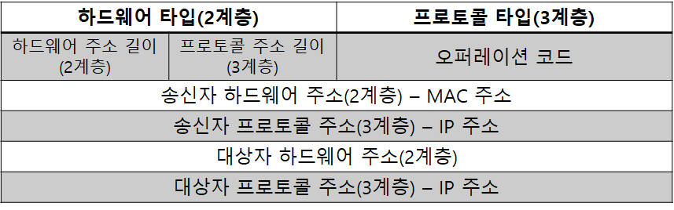
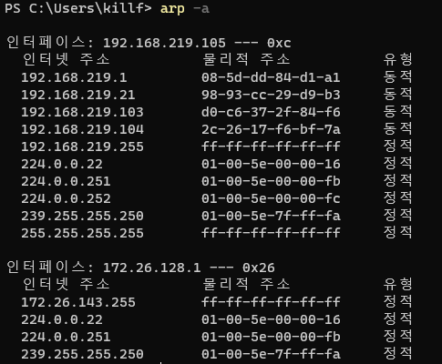
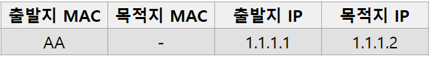
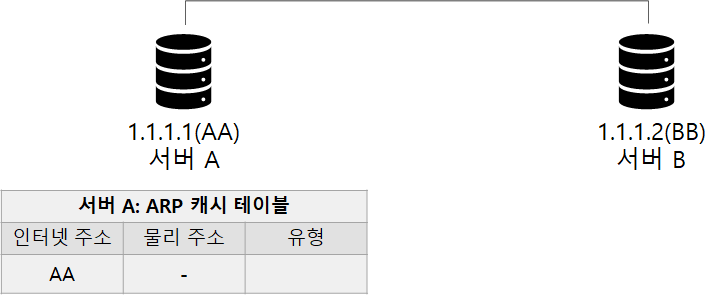
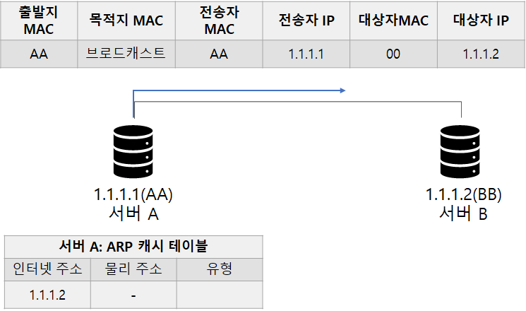
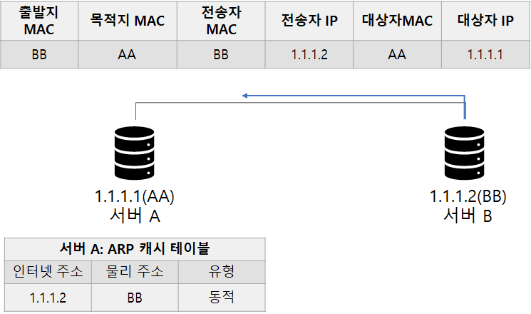
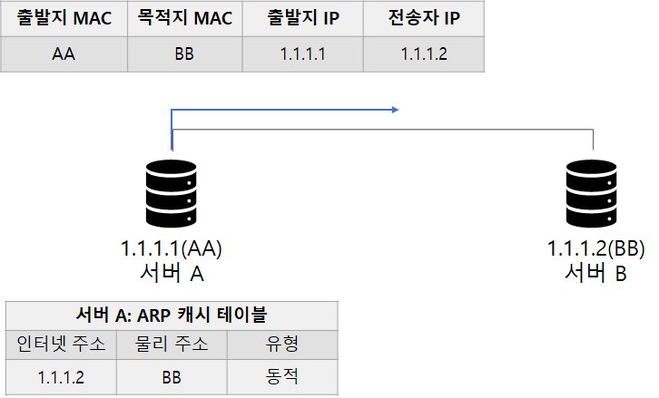

# 1. ARP 란? 
3계층의 IP 주소 체계는 2계층의 MAC 주소와 전혀 연관성이 없다.
- 두 개의 주소를 연계시켜주기 위해 사용하는 프로토콜이 ARP 다.

[이미지 출처](https://catsbi.oopy.io/eec728e7-0a31-4c96-9d33-20421bd5e6b3)

ARP 프로토콜은 TCP/IP 프로토콜 스택만을 위해서 사용하는 것은 아니다
- 3계층의 논리적 주소와 2계층의 물리적 주소를 연결하기 위해서 필요한 프로토콜이다.

상대의 MAC 주소를 알아내기 위해서는 ARP 브로드캐스트를 이용해 네트워크 전체에 상대 MAC 주소를 질의해야 한다.
- ARP 브로드캐스트를 받은 목적지는 자신의 MAC 주소를 응답한다.
- 이 작업이 완료되면 출발지, 목적지 둘 다 상대에 대한 MAC 주소를 학습하고 패킷을 인캡슐레이션한다.
- 윈도 명령 프롬프트에서 `arp -a` 명령을 입력하면 ARP 테이블 정보를 확인할 수 있다.

[이미지 출처](https://catsbi.oopy.io/eec728e7-0a31-4c96-9d33-20421bd5e6b3)

패킷을 전송할 때마다 ARP 브로드캐스트를 수행하면 효율성이 떨어지므로 메모리에 캐싱한다.
- 일정시간 동안 통신 없으면 테이블은 삭제된다.

네트워크 장비에서 ARP 작업은 CPU 에서 직접 수행한다.
- 즉, 짧은 시간에 많은 ARP 요청이 들어오면 장비로서 부하가 크다.
- 따라서 네트워크 장비는 캐싱하는 시간을 일반 PC 보다 더 길게 잡는다.

---

# 2. ARP 동작
ARP 패킷은 다음과 같은 필드로 구성된다.
1. 송신자 하드웨어 MAC 주소
2. 송신자 IP 프로토콜 주소
3. 대상자 MAC 주소
4. 대상자 IP 프로토콜 주소

### 서버 A 에서 B 로 Ping 을 보낸다.

    
[이미지 출처](https://catsbi.oopy.io/eec728e7-0a31-4c96-9d33-20421bd5e6b3)

- 서버 A 에서는 3계층의 IP 주소까지 캡슐화할 수 있다.
- 하지만, MAC 주소를 모르므로 정상적인 패킷을 만들 수 없다.

### ARP 브로드캐스트를 진행한다.

A 는 B 의 MAC 주소 (1.1.1.2 IP 의 MAC 주소) 를 알기 위해 ARP 요청 네트워크를 브로드캐스트 한다.
- 출발지, 전송자 MAC 주소는 자신의 MAC 주소
- 목적지 MAC 주소는 브로드캐스트(FF-FF-FF-FF-FF-FF) 로
- 대상자 MAC 주소는 00-00-00-00-00-00 으로 채워서 네트워크에 뿌린다.

### 브로드캐스트 응답

[이미지 출처](https://catsbi.oopy.io/eec728e7-0a31-4c96-9d33-20421bd5e6b3)

2계층 목적지 주소가 브로드캐스트이므로 수신 네트워크 안에 있는 모든 단말에 요청을 보낸다
- 모든 단말은 ARP 프로토콜 내용을 확인하고 대상자 IP 가 맞는지 확인한다
- 서버 B 본인에 대한 요청임을 확인하면 그에 대한 응답을 보낸다
- 이때는 송신자와 대상자의 위치가 바뀐다.
- 목적지 MAC 은 브로드캐스트가 아닌 요청받은 ARP 프로토콜의 출발지 MAC 이 된다.

### 테이블 갱신 및 패킷 송신

[이미지 출처](https://catsbi.oopy.io/eec728e7-0a31-4c96-9d33-20421bd5e6b3)

서버 A 는 ARP 응답을 받으면 자신의 ARP 테이블을 갱신한다.
- 이후, 상대의 MAC 주소를 알고 있기에 도착지 MAC 주소 필드를 완성해서 ping 패킷을 보낸다.

---
# 3. GARP
자신이 속한 네트워크에 자신의 IP 와 MAC 주소를 알릴 목적으로 사용된다.
- 송신자 MAC 주소는 자신의 MAC 주소
- 송신자 IP 주소는 자신의 IP 주소
- 대상자 MAC 주소는 모두 0으로 표기
- 대상자 IP 주소는 자신의 IP 주소

GARP 를 사용하는 이유는 다음 3가지다.
1. IP 주소 충돌 감지
   - 내가 할당받은 IP 를 다른 사람이 사용하고 있는 경우를 예방
2. 상대방(동일 서브넷 상의 다른)의 ARP 테이블 갱신
   - 장비의 이중화를 위해 사용된다.
   - 스탠바이 장비가 액티브 상태가 되면 GARP 패킷을 네트워크에 보내 액티브 장비가 변경됨을 알리는 것
3. HA(고가용성) 용도의 클러스터링 VRRP, HSRP
   - 가상 MAC 을 사용하는 클러스터링, VRRP, HSRP 와 같은 FHRP(First Hop Redundancy Protocol) 에서 사용한다.
   
--- 
# 4. RARP
Reverse ARP 의 줄임말
- GARP 처럼 ARP 프로토콜 구조는 동일하나 필드에 들어가는 내용과 목적이 다르다
- IP 주소가 정해져 있지 않은 단말이 IP 할당을 요청할 때 사용한다.
- 나 자신의 MAC 주소를 알지만 IP 가 아직 할당되지 않은 것
- 하지만 제한된 기능으로 인해 BOOTP 와 DHCP 로 대체되어 사용되지 않는다.

