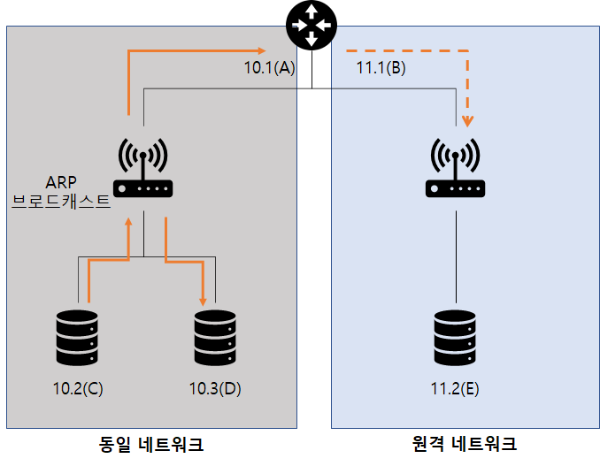
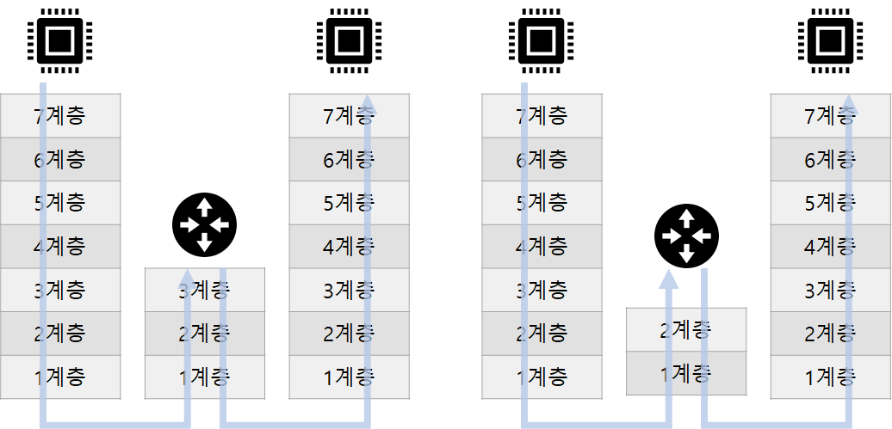

# 1. 서브넷과 게이트웨이의 용도
원격 네트워크 통신은 네트워크 장비의 도움이 필요하다
- 이 장비를 게이트웨이라고 한다.
- 게이트웨이에 대한 정보를 PC나 네트워크 장비에 설정하는 것이 "기본 게이트웨이"다.

[이미지 출처](https://catsbi.oopy.io/315731e3-1730-4690-ad8f-663e0af7621b)

기본 게이트웨이는 여러 게이트웨이 중 기본으로 통과할 것을 의미한다.
- 기본 게이트웨이는 3계층 장비가 수행한다.
- 여러 네트워크가 연결되어 적절한 경로를 지정해주는 역할을 한다.

[이미지 출처](https://jay-din.tistory.com/91#:~:text=%EC%9D%BC%EB%B0%98%EC%A0%81%EC%9C%BC%EB%A1%9C%20%EA%B2%8C%EC%9D%B4%ED%8A%B8%EC%9B%A8%EC%9D%B4%EC%9D%98%20IP,%EB%8A%94%20123.123.123.1%EC%9D%B4%20%EB%90%A9%EB%8B%88%EB%8B%A4.)

---
# 2. 2계층 통신 VS 3계층 통신
정확한 표현은 로컬 네트워크 통신 VS 원격지 네트워크 통신이다.

[이미지 출처](https://catsbi.oopy.io/315731e3-1730-4690-ad8f-663e0af7621b)

단말간의 통신은 애플리케이션 계층에서부터 시작해 캡슐화 디캡슐화를 거쳐 통신한다.
- 반면, 로컬 네트워크 통신은(출발지와 목적지가 같은 경우) 라우터와 같은 장비 없이 통신이 가능하다.
- 이는 단말 간 연결해주는 네트워크 장비는 2계층까지만 정보를 확인해서 통신하면 된다.

3계층 통신
- 원격지 네트워크와 통신해야 하는 경우, 라우터와 같은 3계층의 장비가 필요하다.
- 네트워크 장비에서 3계층까지 정보를 확인해야 한다.
- 이를 L3 통신이라 부른다.
- 도착지 MAC 주소와 IP 주소가 다르다.
- 도착지 IP 주소는 실제 도착지이며, MAC 주소는 디폴드 게이트웨이의 MAC 주소가 사용된다.

2계층 통신
- 로컬 네트워크에서 직접 통신한다면 3계층 장비가 필요 없다.
- 2계층까지만 정보를 확인 후, ARP 요청을 직접 브로드캐스트를 이용한다.
- 이를 L2 통신이라 부른다.